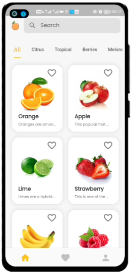
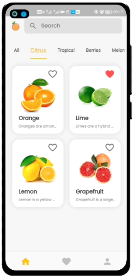
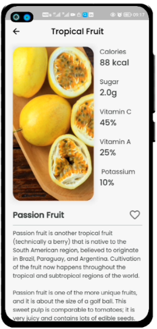
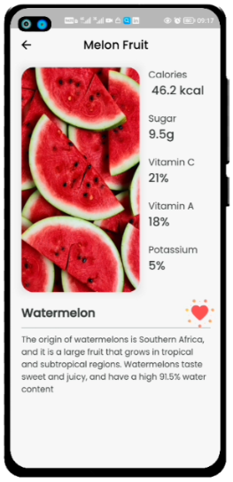
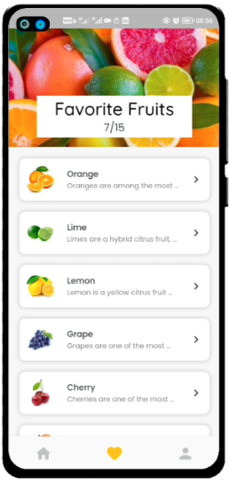
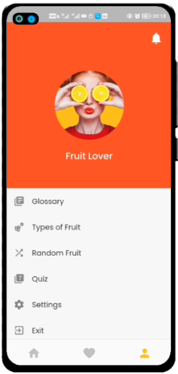
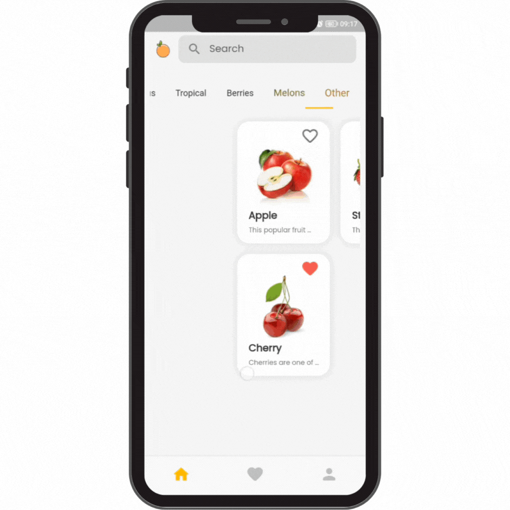

# fruit_tiedot🍊

Built using the popular Flutter framework, this app is for anyone who loves fruits.

Fruit tiedot is an app that provides users with information about the various types of fruits and their nutritional benefits. The app includes photos and descriptions of each fruit, along with detailed nutritional intake based on RDA (Recommended Daily Allowance). This makes it easy for users to understand the health benefits of each fruit and some trivial information.

Using the Fruit App is a great way to learn more about the fruits you eat and take advantage of how they can assist you in creating a healthier lifestyle. Try new fruits ;-).

### Some concepts that were utilised in the development of this app
- State management
- Flutter animations
- Refactoring Widgets
- Responsive Design
- Event-driven programming
- Pubspec for external Packages
- Software Architecture (MVC concepts)

*****
## Screenshots
\
&nbsp;&nbsp;&nbsp;&nbsp;&nbsp;&nbsp;&nbsp;&nbsp;&nbsp;&nbsp;&nbsp;&nbsp;

&nbsp;&nbsp;&nbsp;&nbsp;&nbsp;&nbsp;&nbsp;&nbsp;&nbsp;&nbsp;&nbsp;&nbsp;

## Getting Started

If you want learn how to build Flutter applications.

A few resources to get you started on your first Flutter project:

- [Lab: Write your first Flutter app](https://docs.flutter.dev/get-started/codelab)
- [Cookbook: Useful Flutter samples](https://docs.flutter.dev/cookbook)

For help getting started with Flutter development, view the
[online documentation](https://docs.flutter.dev/), which offers tutorials,
samples, guidance on mobile development, and a full API reference.

Sincerely,\
-Elias Kekana
